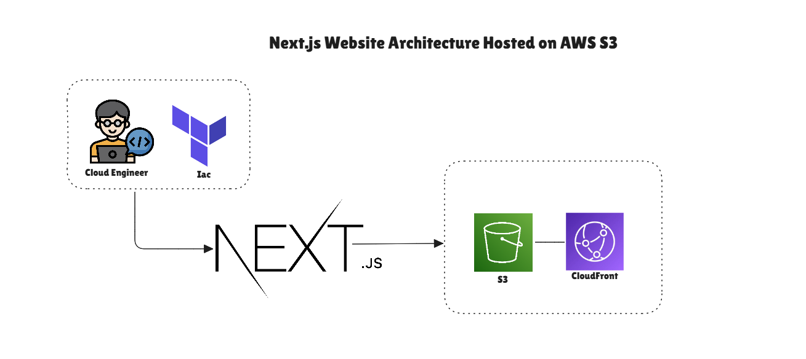
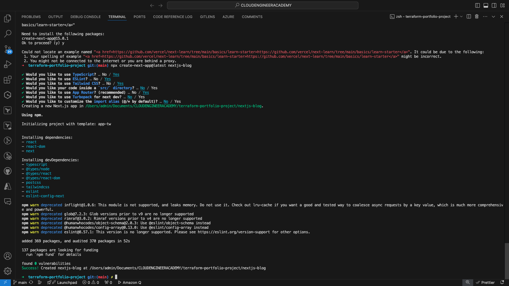
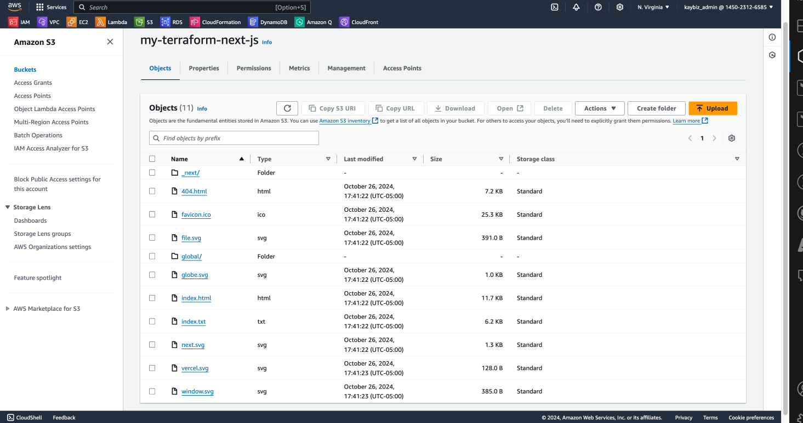
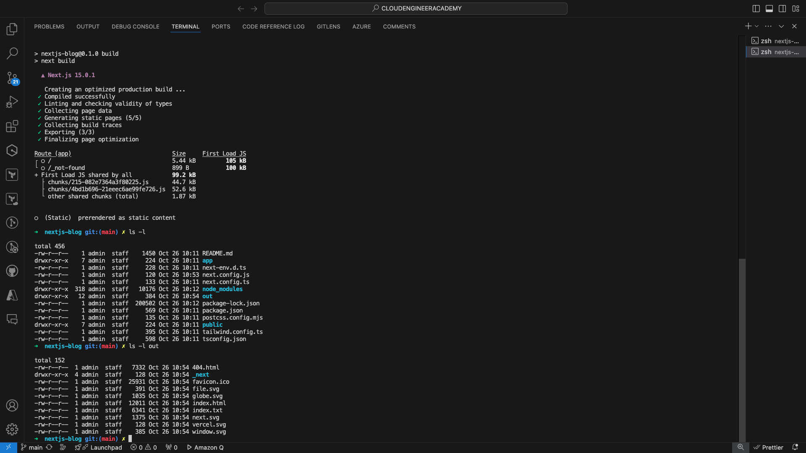
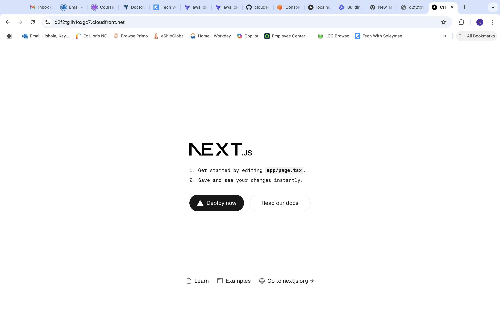
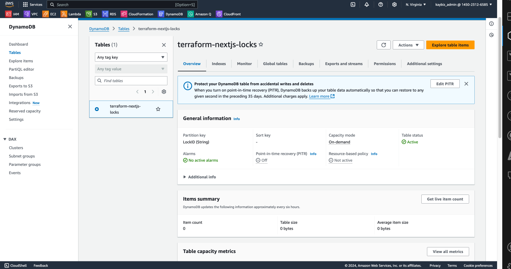
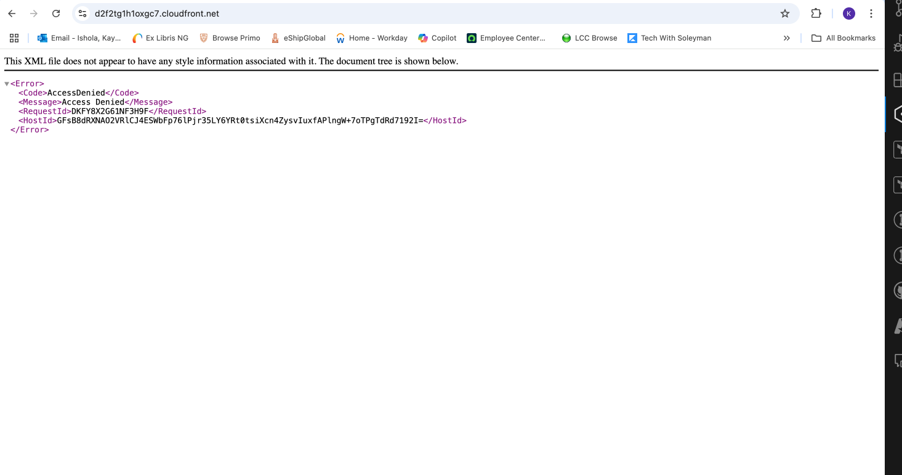
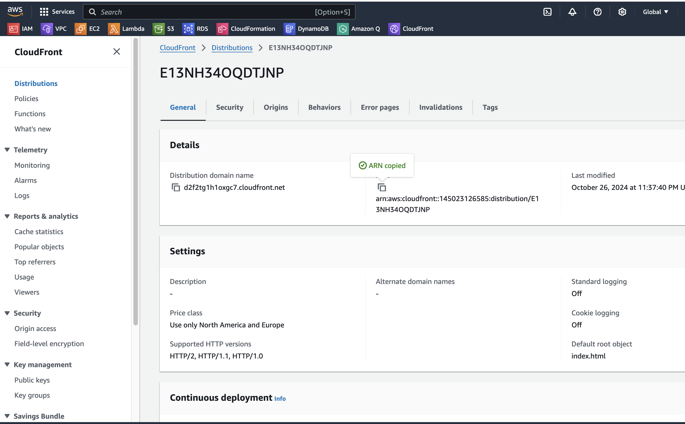

# Terraform NextJS Infrastructure on AWS

## Project Overview

This project demonstrates the deployment of a NextJS application on AWS using Terraform for infrastructure as code. It showcases how to 
create a scalable, secure, and highly available web application infrastructure, putting into practice various cloud and DevOps concepts.

**Disclaimer:** This project is part of my learning journey in cloud engineering and DevOps. I welcome all comments, suggestions, and 
contributions as I continue to improve and expand my skills.

## Table of Contents
1. [Architecture](#architecture)
2. [Project Demonstration Videos](#project-demonstration-videos)
3. [Prerequisites](#prerequisites)
4. [Project Structure](#project-structure)
5. [Setup and Deployment](#setup-and-deployment)
6. [Infrastructure Components](#infrastructure-components)
7. [Customization](#customization)
8. [Monitoring and Maintenance](#monitoring-and-maintenance)
9. [Troubleshooting](#troubleshooting)
10. [Cleaning Up](#cleaning-up)
11. [Contributing](#contributing)
12. [License](#license)

## Architecture

Below is the high-level architecture of our NextJS application infrastructure:

This architecture leverages several AWS services to create a robust, scalable, and secure hosting environment for a NextJS application.

## Project Demonstration Videos

1. Initial NextJS Setup: [Watch the video](https://www.loom.com/share/e1505fecfa784aa882a61701f2636c68)
   This video covers the initial setup of the NextJS application.

2. Terraform Configuration and Deployment: [Watch the 
video](https://www.loom.com/share/194ed10525bc449881085596facf381c?sid=3ae21146-9783-410f-b489-d423e5254417)
   This video provides an in-depth explanation of the Terraform configuration and the deployment process.

## Prerequisites

Before you begin, ensure you have the following:
- AWS CLI installed and configured with appropriate credentials
- Terraform installed (version 1.0.0 or later)
- Git for version control
- Node.js and npm (for NextJS development)
- A NextJS application ready for deployment

## Project Structure

- `main.tf`: Primary Terraform configuration
- `variables.tf`: Variable definitions
- `outputs.tf`: Output value definitions
- `backend_setup.tf`: S3 backend configuration for Terraform state
- `statefile.tf`: State management setup
- `providers.tf`: AWS provider configuration
- `nextjs-app/`: Directory containing the NextJS application

## Setup and Deployment

1. Clone the repository:
git clone Your Repository URL
cd Your Project Directory

2. Initialize Terraform:
terraform init

3. Review the planned changes:
terraform plan

4. Apply the Terraform configuration:
terraform apply

5. Confirm the changes by typing `yes` when prompted.

6. After successful application, you should see the S3 bucket created with your NextJS application files:

7. Access your application via the CloudFront URL:

## Infrastructure Components

### S3 Bucket
- Used for hosting static website files
- Configured with appropriate bucket policies for security

### CloudFront Distribution
- Provides global content delivery
- Improves latency and performance for users worldwide

### Route53
- Manages domain routing
- Connects custom domain to CloudFront distribution

### ACM Certificate
- Provides HTTPS security for the application
- Automatically renewed by AWS

### DynamoDB
- Used for Terraform state locking
- Prevents concurrent modifications to the infrastructure

## Customization

To customize the infrastructure:
1. Modify the variables in `variables.tf` or create a `terraform.tfvars` file.
2. Update `main.tf` to add or modify resources as needed.
3. If you need to adjust the NextJS application, update it in the `nextjs-app/` directory and redeploy.

## Monitoring and Maintenance

- Set up CloudWatch alarms for monitoring key metrics
- Regularly update the NextJS application and redeploy as needed
- Keep Terraform and provider versions up to date

## Troubleshooting

### CloudFront Access Denied

If you see an access denied page when accessing your CloudFront URL:

This could be due to misconfigured bucket policies or CloudFront settings. Double-check your S3 bucket policy and CloudFront distribution 
settings.

### Successful CloudFront Access

When correctly configured, you should see your NextJS application via the CloudFront URL:

## Cleaning Up

To destroy the created resources and avoid unnecessary AWS charges:
terraform destroy

Confirm the destruction by typing `yes` when prompted.

## Contributing

I  welcome contributions to improve this project. Please follow these steps:
1. Fork the repository
2. Create a new branch for your feature
3. Commit your changes
4. Push to the branch
5. Create a new Pull Request

All feedback, suggestions, and contributions are highly appreciated as they help in the learning process and improvement of the project.

---

This project is a continuous learning experience. I'm always looking to improve and expand my knowledge in cloud engineering and DevOps 
practices. If you have any suggestions, corrections, or ideas for improvement, please don't hesitate to reach out or contribute. Your input 
is valuable in this learning journey!

